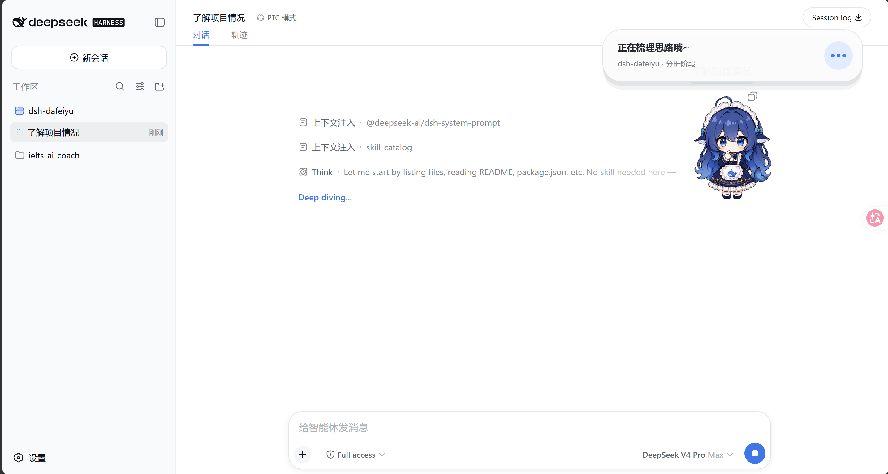
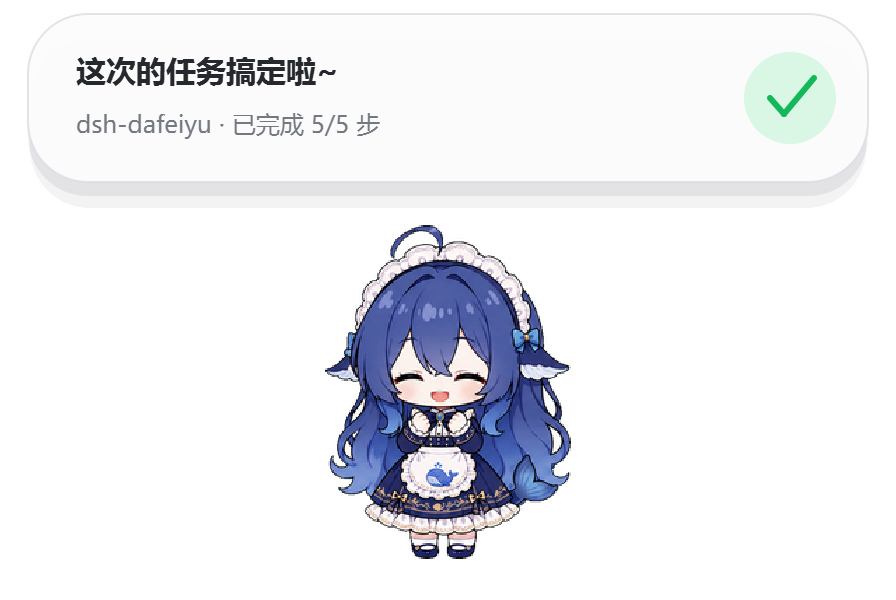
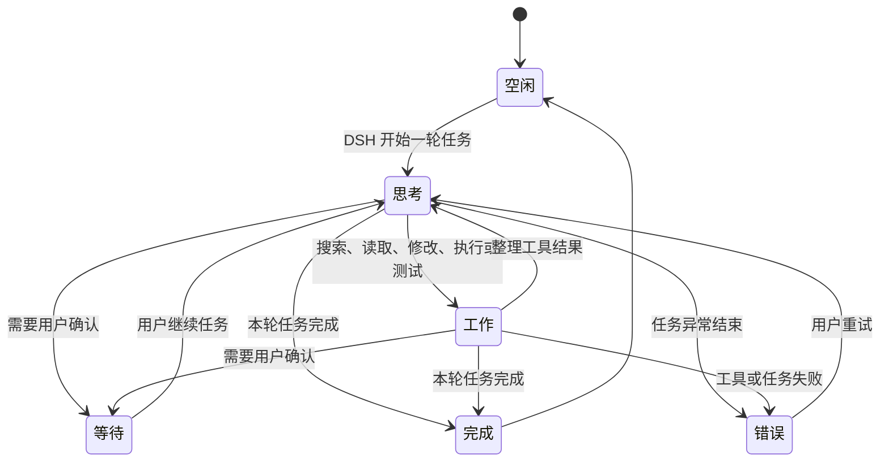
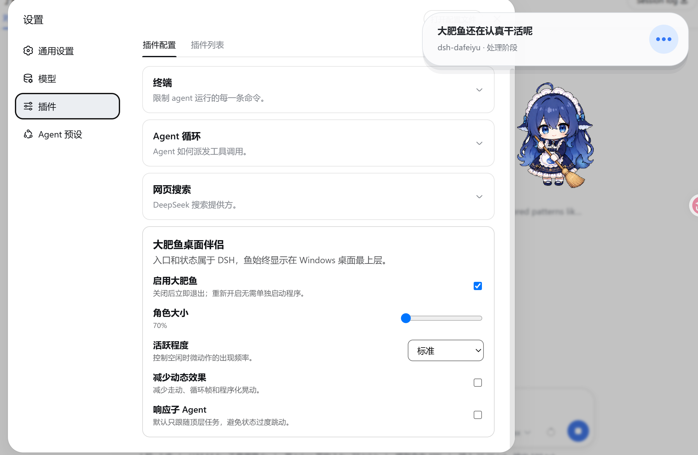

<div align="center">

# DSH 大肥鱼 🐋

**住在 Windows 桌面上、由 DeepSeek Harness 真实工作状态驱动的 Agent 伴侣。**

入口属于 DSH，生命周期属于 DSH，显示层属于桌面。

[English](README_EN.md) · [GitHub](https://github.com/nolodjska/dsh-dafeiyu) · [下载最新版本](https://github.com/nolodjska/dsh-dafeiyu/releases/tag/v0.1.0-alpha.6) · [更新与回退](docs/UPDATING.md) · [验收记录](docs/ACCEPTANCE.md)

</div>



DSH 大肥鱼不是一个需要单独启动的桌宠应用。它由 DSH 插件启用，跟随 DSH
一起启动和退出，并以透明、无边框、始终置顶的原生窗口显示在桌面上。即使切换到
VS Code、浏览器或文件管理器，也能知道 DSH 当前在思考、修改、测试、等待还是已经完成。

> 当前版本：`0.1.0-alpha.6`（二次开发版）· Windows 10/11 x64

> 本仓库是作者基于 [QCYTSN/ds-local-pet](https://github.com/QCYTSN/ds-local-pet) 的
> **二次开发版本**：把原独立桌宠改造成由 DSH 真实工作状态驱动的插件桌宠，并加入了
> 动作循环照片墙、启用拨纽、提问/回答表情、坐姿补偿放大等改动。**未发布到 npm**，
> 请从本仓库安装。

## 它有什么用？

- **离开 DSH 页面也能看到状态**：大肥鱼始终显示在 Windows 桌面最上层。
- **反馈来自真实 Agent 事件**：不会读取屏幕，也不会把你在其他软件里的操作误判为 DSH 工作。
- **展示足够但不过量的信息**：项目名、当前阶段、正在进行的步骤和真实待办进度会显示在状态卡上。
- **有生命力但不打扰**：思考、查找、修改、执行、验证、等待、完成和错误都有对应动作与自然文案。
- **看得见改了什么**：设置页的动作循环照片墙逐帧展示每个动作的图片，并可一键在
  系统文件资源管理器中定位到对应目录。
- **没有第二套应用入口**：无需单独运行 Helper、安装 Python或配置额外端口。

如果 DSH 没有提供待办清单，大肥鱼只显示“分析阶段”“实现阶段”“验证阶段”等可靠信息，
不会编造完成百分比。

## 状态展示

| 思考 | 工作 |
| --- | --- |
|  |  |

| 等待确认 | 完成 |
| --- | --- |
|  |  |

| 遇到问题 |
| --- |
|  |

状态大致按照下面的流程变化：



多个 DSH Session 同时运行时，默认优先展示最需要注意的顶层任务：

`等待确认 > 错误 > 工作 > 思考 > 空闲`

干活状态的细节：

- **连续工具不来回切换**：一轮任务里只要用过工具，桌宠就保持工作（坐姿）姿态直到
  回合结束，不会在工具间隙反复起身、思考、再坐下。
- **工作与查资料平衡**：干活中穿插的搜索，短暂查询（< 1.2s）保持坐姿不切换动作；
  持续查询（≥ 1.2s）才拿起书阅读，长查询（≥ 2.4s）结束后才有星眼/开心收尾。
- **状态卡字幕**：提问时字幕显示实际提问的问题，一行放不下自动换行、卡片按需增高。

## 系统要求

- Windows 10/11 x64
- 已安装并能正常运行的 DeepSeek Harness WebUI
- DSH CLI 中可以使用 `plugin --profile web` 命令
- 本仓库（`nolodjska/dsh-dafeiyu`）的源码包，或 GitHub Release 中的 `.tgz` 安装包

普通用户**不需要**安装 Python、PySide6 或单独运行
`dsh-dafeiyu-helper.exe`。Windows Helper 已经包含在发布包里。

当前 Alpha 版的设置与桌面状态文案使用简体中文。

## 安装插件

### 1. 完全退出 DSH

先关闭 DSH Host，而不只是关闭浏览器标签页。安装或更新时不要让旧版插件继续运行。

### 2. 从源码打包安装

本仓库未发布到 npm，需要先在仓库目录打包出 `.tgz`。克隆仓库（或在
[GitHub Releases](https://github.com/nolodjska/dsh-dafeiyu/releases/tag/v0.1.0-alpha.6)
下载现成的 `dsh-dafeiyu-<version>.tgz`），然后在仓库目录执行：

```powershell
cd D:\path\to\dsh-dafeiyu-main
npm pack
```

会生成 `dsh-dafeiyu-0.1.0-alpha.6.tgz`（随包携带预构建的 Windows Helper，
**不解压**）。接着在 DSH 安装目录安装：

```powershell
cd D:\DSH
pnpm exec dsh plugin --profile web add "D:\path\to\dsh-dafeiyu-main\dsh-dafeiyu-0.1.0-alpha.6.tgz"
```

如果你的系统已经能直接使用全局 `dsh` 命令，把 `pnpm exec dsh` 换成 `dsh` 即可。

### 3. GitHub Release 备用安装方式

进入 [GitHub Releases](https://github.com/nolodjska/dsh-dafeiyu/releases/tag/v0.1.0-alpha.6)，
下载最新的：

```text
dsh-dafeiyu-<version>.tgz
```

不要解压这个文件。不解压，在 DSH 目录中直接安装下载的插件包：

```powershell
pnpm exec dsh plugin --profile web add "C:\Users\you\Downloads\dsh-dafeiyu-<version>.tgz"
```

### 4. 启动 DSH

照常启动 DSH WebUI。插件默认启用，大肥鱼会由 DSH 自动拉起；不要手动打开 Helper。

### 5. 找到设置入口

在 DSH WebUI 中进入：

```text
设置 → 桌宠
```

「桌宠」页集中提供全部设置：立绘、启用拨纽、角色大小、活跃程度、减少动态、响应
子 Agent，以及动作循环照片墙。



## 怎么使用？

安装后不需要额外操作：

1. 启动 DSH。
2. 在 DSH 中开始一个项目任务。
3. 大肥鱼根据 DSH 的真实事件切换动作和状态卡。
4. 切换到其他窗口继续工作；大肥鱼仍然保持在桌面最上层。
5. DSH Host 真正退出后，大肥鱼自动退出。

状态卡可能显示：

- 项目目录名称，例如 `dsh-dafeiyu`
- 当前阶段，例如“分析阶段”“实现阶段”“验证阶段”
- 当前待办，例如“完善项目文档”
- 真实进度，例如“已完成 3/5 步”
- 等待、完成或错误提示

大肥鱼不会监听 VS Code、浏览器或其他应用，也不会截图。只有 DSH Agent 的事件能够
改变它的工作状态。

## 可配置项目

| 设置 | 作用 |
| --- | --- |
| 启用大肥鱼 | 立即显示或关闭桌面伴侣 |
| 角色大小 | 在 70%～140% 之间调整 |
| 活跃程度 | 控制空闲时眨眼、观察等微动作频率 |
| 减少动态效果 | 减少走动、循环帧和程序化晃动 |
| 响应子 Agent | 允许子 Agent 状态参与优先级选择；默认关闭 |

设置由 DSH 保存，更新插件后通常不需要重新配置。

「桌宠」设置页还提供动作循环照片墙，用于逐帧查看每个动作循环的图片并定位文件，
详见下文「动作循环照片墙与 manifest 契约（二次开发）」。

## 桌面互动

- **拖动**：按住大肥鱼移动位置，位置会自动保存。
- **点击或双击**：触发摸头、戳一下、尾巴等短互动，之后恢复最新 DSH 状态。
- **提问/回答**：DSH 向你提问（`ask_user_question`）时显示 `question` 表情并保持，
  状态卡字幕显示实际提问的问题（一行放不下自动换行、卡片按需增高）；你回答后短暂
  显示 `answer` 表情（约 2.4s）再恢复。
- **右键菜单**：调整大小、减少动态、本次隐藏或本次关闭。
- **本次隐藏**：只隐藏窗口，不禁用插件。
- **本次关闭**：关闭当前 Helper，本次 DSH 运行期间不会自动重启；下次启动 DSH 会再次出现。

## 更新插件

本仓库出现新提交后，已经安装的插件**不会自动变化**。更新时完全退出 DSH，在仓库
目录拉取最新代码并重新打包安装：

```powershell
cd D:\path\to\dsh-dafeiyu-main
git pull
npm pack
cd D:\DSH
pnpm exec dsh plugin --profile web add "D:\path\to\dsh-dafeiyu-main\dsh-dafeiyu-<version>.tgz"
```

使用 GitHub Release 安装的用户，下载新 `.tgz` 后覆盖安装即可。以上方式都会替换
插件及随包携带的 Windows Helper，并保留 DSH 已保存的设置。详细说明见
[插件更新与回退](docs/UPDATING.md)。

## 回退到旧版本

完全退出 DSH，重新安装之前保留的旧版 `.tgz`：

```powershell
cd D:\DSH
pnpm exec dsh plugin --profile web add "C:\Users\you\Downloads\dsh-dafeiyu-<old-version>.tgz"
```

## 卸载插件

完全退出 DSH 后运行：

```powershell
cd D:\DSH
pnpm exec dsh plugin --profile web remove dsh-dafeiyu
```

然后重新启动 DSH。插件代码和 Helper 会从 `web` profile 中移除。DSH 可能保留一份
不会再生效的历史设置，这不会启动进程或占用额外端口。

## 常见问题

<details>
<summary><strong>安装后没有看到大肥鱼</strong></summary>

1. 确认安装使用的是 `--profile web`。
2. 完全退出并重新启动 DSH Host。
3. 进入“设置 → 桌宠”确认“启用桌宠”拨纽已经打开。
4. 确认使用 Windows x64 发布包，而不是只克隆了缺少预构建 Helper 的源码。

</details>

<details>
<summary><strong>关闭了 DSH 网页，为什么大肥鱼还在？</strong></summary>

大肥鱼绑定的是 DSH Host 生命周期，而不是浏览器标签页。只要 DSH 后台仍在运行，
大肥鱼就会继续显示；真正退出 DSH Host 后它会自动关闭。

</details>

<details>
<summary><strong>为什么没有显示数字进度？</strong></summary>

只有 DSH 写入了结构化待办时，插件才能可靠计算“已完成 3/5 步”。没有真实待办数据时，
状态卡只显示当前工作阶段，避免制造虚假的百分比。

</details>

<details>
<summary><strong>右键选择“本次关闭”后为什么没有自动回来？</strong></summary>

这是预期行为。“本次关闭”会抑制当前 DSH 运行期间的自动重启；完全退出并重新启动
DSH 后会恢复。若想永久关闭，请在 DSH 设置中关闭“启用桌宠”拨纽。

</details>

## 隐私与边界

- 不读取或保存模型 API Key
- 不截图，不读取其他窗口内容
- 不发送遥测
- 不监听键盘输入或其他应用行为
- 不新开网络端口；设置卡复用 DSH 的本地 Web 服务
- 默认只跟随最近活跃的顶层 DSH Session

## 动作循环照片墙与 manifest 契约（二次开发）

DSH 设置页左侧导航的 **设置 → 桌宠** 页面提供：

- **启用桌宠拨纽**：一个拨纽（switch），不再使用复选框。
- **动作循环照片墙**：每个动作循环一行缩略图，每帧下方标注文件名（与 Helper
  桌面调试日志 `debug-animation.log` 中的 `frame=` 一一对应），并带一个
  **打开文件夹** 按钮，由插件自有 host 路由直接 `explorer.exe` 打开该循环
  图片所在目录（系统文件资源管理器，不走 DSH 的 `workspaces.openPath`
  文件打开漏斗，因此不会被 dsh-better-sidebar 等插件劫持到侧边栏编辑器）。

照片墙**不是硬编码**，而是由角色清单 `assets/pet-manifest.json` 中的
`photoWall` 契约动态驱动。修改契约或替换图片后，点击照片墙右上角的
**重新加载** 即可热更新，无需重启 DSH、无需重建 Helper。

### photoWall 契约

`pet-manifest.json` 顶层新增一个 `photoWall` 数组，每个元素描述一个动作循环：

```json
{
  "photoWall": [
    {
      "id": "searching",
      "label": "搜索",
      "clips": ["searching_stay", "searching_ready", "searching_reading", "searching_sigh", "searching_throw", "searching_got_it", "searching_starry", "searching_happy"]
    },
    {
      "id": "idle",
      "label": "待机",
      "clips": ["idle", "blink", "glance", "sweep"],
      "folder": "."
    }
  ]
}
```

字段说明：

| 字段 | 必填 | 说明 |
| --- | --- | --- |
| `id` | 是 | 分组唯一标识，作为照片墙行的 `key` |
| `label` | 是 | 照片墙行标题（中文文案） |
| `clips` | 是 | 属于该循环的 clip 名称数组，每一项必须存在于 `clips` 对象中 |
| `folder` | 否 | 「打开文件夹」定位的目录，相对 `assets/pet/`；缺省取第一个 clip
  第一帧所在目录；`.` 表示打开整个 `assets/pet/` 根目录 |

渲染规则：

- 按 `clips` 声明顺序展开各 clip 的 `frames`，**去重**后从左到右排列
  （例如 `working_seat_in` 与 `working_seat_out` 共用同一组 `seat_01..05` 帧，
  照片墙只显示一次）。
- 每个 clip 名必须存在于 `clips` 中，否则该 clip 被跳过；没有任何有效帧的
  分组不会出现在照片墙上。
- clip 可带可选的 `"scale"` 数值（缺省 `1.0`，范围 0.5～3.0）：补偿性放大
  系数。例如坐着干活的帧里角色加凳子后显得偏小，给工作 clip 设
  `"scale": 1.08` 后绘制时会整体放大（底部锚定，不改变窗口尺寸）。照片墙
  缩略图不受影响，始终原样展示。
- 「打开文件夹」请求插件的 `GET /plugins/dsh-dafeiyu/open-folder?folder=<id>`
  路由，宿主把 `folder` 解析到 `assets/pet/` 下并直接 `explorer.exe` 打开；
  `folder` 必须是单个路径段或 `.`，宿主会校验目录存在且不越出资源根目录。
  该路由需要重启一次 DSH Host 后生效。

### 新增一个动作模组

1. 把新图片放入 `assets/pet/<新目录>/`，或在既有目录中替换同名文件。
2. 在 `clips` 中声明新 clip（`frames`、`frameMs`、`loop`、`motion` 等）。
3. 在 `photoWall` 中加入（或改写）对应分组，`clips` 引用新 clip。
4. 回到 DSH 设置页，点击照片墙右上角 **重新加载**。

## 开发与测试

```powershell
pnpm install
npm test
py -3 -m unittest discover -s runtime/tests -t .
```

开发时可以从源码运行 Helper，但正式用户不应手动启动它：

```powershell
py -3 -m pip install -r requirements.txt
py -3 runtime\helper.py
```

构建 Windows Helper：

```powershell
python -m pip install -r requirements.txt pyinstaller
$env:DSH_DAFEIYU_BUILD_PYTHON = (Get-Command python).Source
npm run build:helper:windows
```

## 更多文档

- [产品范围与取舍](docs/PRODUCT_SCOPE.md)
- [执行计划](docs/EXECUTION_PLAN.md)
- [兼容性验证](docs/PHASE0.md)
- [Windows 验收与性能记录](docs/ACCEPTANCE.md)
- [更新、回退与卸载](docs/UPDATING.md)
- [角色视觉资产许可](ASSET_LICENSE.md)

上游项目：[QCYTSN/ds-local-pet](https://github.com/QCYTSN/ds-local-pet) 是作者基于的
独立桌宠版本；本仓库是它的二次开发版本——只服务于 DSH 状态的插件桌宠。

## License

代码采用 [MIT License](LICENSE)。角色视觉资产不适用 MIT 代码许可证，来源和使用边界
见 [ASSET_LICENSE.md](ASSET_LICENSE.md)。
