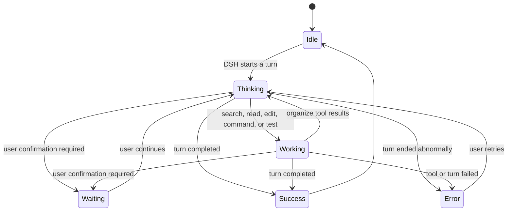

<div align="center">

# DSH BigFish 🐋

**A desktop companion that lives on Windows and reacts to real DeepSeek Harness activity.**

Enabled by DSH, owned by the DSH lifecycle, rendered on the desktop.

[中文](README.md) · [GitHub](https://github.com/nolodjska/dsh-dafeiyu) · [Latest release](https://github.com/nolodjska/dsh-dafeiyu/releases/latest) · [Update and rollback](docs/UPDATING.md) · [Acceptance notes](docs/ACCEPTANCE.md)

</div>


DSH BigFish is not a standalone desktop-pet application. DSH enables the plugin, starts and
stops its native Helper, and provides the Agent events that drive it. The transparent,
frameless companion stays above other Windows apps, so you can see whether DSH is thinking,
editing, testing, waiting, or finished while working in VS Code, a browser, or File Explorer.

> Current version: `0.1.0-alpha.6` (secondary development) · Windows 10/11 x64

> This repository is the author's **secondary development** based on
> [QCYTSN/ds-local-pet](https://github.com/QCYTSN/ds-local-pet): it turns the standalone
> desktop pet into a plugin driven by real DSH work state, and adds the action-loop photo
> wall, an enable toggle, question/answer faces, and a compensatory scale-up for seated
> working frames. It is **not published to npm** — install from this repository.

## What is it for?

- **See DSH status away from the WebUI:** BigFish stays on top of the Windows desktop.
- **React to real Agent events:** it does not inspect the screen or mistake activity in other apps for DSH work.
- **Show useful, compact context:** the card can display the project, current phase, active step, and real todo progress.
- **Feel alive without becoming noisy:** thinking, searching, editing, commands, testing, waiting, success, and errors have distinct motion and friendly copy.
- **Avoid a second app experience:** users do not launch the Helper, install Python, or configure another port.

If DSH has not emitted a structured todo list, BigFish shows reliable phases such as
“Analysis,” “Implementation,” or “Verification” instead of inventing a percentage.

## Status previews

| Thinking | Working |
| --- | --- |
|  |  |

| Waiting for you | Complete |
| --- | --- |
|  |  |

| Needs attention |
| --- |
|  |

The high-level state flow is:



When several DSH sessions run at once, the default attention priority is:

`Waiting > Error > Working > Thinking > Idle`

## Requirements

- Windows 10/11 x64
- A working DeepSeek Harness WebUI installation
- A DSH CLI that supports `plugin --profile web`
- The source archive of this repository (`nolodjska/dsh-dafeiyu`), or a `.tgz` from
  GitHub Releases

Regular users do **not** need Python or PySide6 and should not launch
`dsh-dafeiyu-helper.exe` manually. The Windows Helper is bundled in the release archive.

The current Alpha build uses Simplified Chinese for the settings UI and desktop status copy.

## Install

### 1. Fully exit DSH

Stop the DSH Host, not only the browser tab. An old Helper should not remain active during
installation or upgrade.

### 2. Install from source

This repository is a secondary development based on
[QCYTSN/ds-local-pet](https://github.com/QCYTSN/ds-local-pet) and is **not published to npm**.
Clone the repository (or
download a ready-made `dsh-dafeiyu-<version>.tgz` from
[GitHub Releases](https://github.com/nolodjska/dsh-dafeiyu/releases/latest)), then in the
repository directory run:

```powershell
cd D:\path\to\dsh-dafeiyu-main
npm pack
```

This produces `dsh-dafeiyu-0.1.0-alpha.6.tgz` (the prebuilt Windows Helper is bundled;
**do not extract it**). Install it from the DSH directory:

```powershell
cd D:\DSH
pnpm exec dsh plugin --profile web add "D:\path\to\dsh-dafeiyu-main\dsh-dafeiyu-0.1.0-alpha.6.tgz"
```

If `dsh` is already available globally, replace `pnpm exec dsh` with `dsh`.

### 3. GitHub Release fallback

Open [GitHub Releases](https://github.com/nolodjska/dsh-dafeiyu/releases/latest) and download:

```text
dsh-dafeiyu-<version>.tgz
```

Do not extract it. Install the downloaded archive from the DSH directory:

```powershell
pnpm exec dsh plugin --profile web add "C:\Users\you\Downloads\dsh-dafeiyu-<version>.tgz"
```

### 4. Start DSH

Launch the DSH WebUI normally. The plugin is enabled by default, and DSH starts BigFish
automatically. Do not start the Helper yourself.

### 5. Open the settings

In the DSH WebUI, go to (recommended):

```text
Settings → Desktop Pet
```

The **Desktop Pet** page offers the portrait, the enable toggle, and the action-loop photo
wall. All settings are also available under:

```text
Settings → Plugins → Plugin configuration → BigFish Desktop Companion
```


## How to use it

There is no separate workflow after installation:

1. Start DSH.
2. Begin a project task in DSH.
3. BigFish reacts to real DSH events and updates its animation and status card.
4. Switch to another app; BigFish remains above the desktop.
5. BigFish exits automatically when the DSH Host actually stops.

The status card can show:

- the project directory, such as `dsh-dafeiyu`
- the current phase, such as Analysis, Implementation, or Verification
- the active todo, such as “Improve project documentation”
- real progress, such as “3/5 steps complete”
- waiting, success, or error messages

BigFish does not watch VS Code, browsers, or other apps and does not take screenshots. Only
DSH Agent events can change its work state.

## Settings

| Setting | Purpose |
| --- | --- |
| Enable BigFish | Show or stop the desktop companion immediately |
| Character size | Scale the character from 70% to 140% |
| Activity level | Control the frequency of idle blinks and micro-animations |
| Reduced motion | Reduce walking, looping frames, and procedural movement |
| Include subagents | Allow subagent sessions to participate in status priority; off by default |

DSH persists these settings, so a normal plugin update does not require reconfiguration.

## Desktop interactions

- **Drag:** move BigFish; its position is saved automatically.
- **Click or double-click:** trigger brief head-pat, poke, or tail reactions, then return to the latest DSH state.
- **Right-click:** change size, reduce motion, hide for now, or close for this run.
- **Hide for now:** hides the window without disabling the plugin.
- **Close for this run:** closes the current Helper and suppresses restart until the next DSH launch.

## Update

An installed plugin does **not** change when new commits appear on GitHub. To update, fully
exit DSH, pull the latest code in the repository and repack it:

```powershell
cd D:\path\to\dsh-dafeiyu-main
git pull
npm pack
cd D:\DSH
pnpm exec dsh plugin --profile web add "D:\path\to\dsh-dafeiyu-main\dsh-dafeiyu-<version>.tgz"
```

Users who installed from GitHub Releases can download the new `.tgz` and install it over the
old version. Either path replaces the plugin and bundled Windows Helper while retaining
settings saved by DSH. See [Update and rollback](docs/UPDATING.md) for details.

## Roll back

Fully exit DSH and install a previously saved release archive with the same `add` command:

```powershell
cd D:\DSH
pnpm exec dsh plugin --profile web add "C:\Users\you\Downloads\dsh-dafeiyu-<old-version>.tgz"
```

## Uninstall

Fully exit DSH, then run:

```powershell
cd D:\DSH
pnpm exec dsh plugin --profile web remove dsh-dafeiyu
```

Restart DSH afterward. The plugin and Helper are removed from the `web` profile. DSH may keep
an inactive copy of historical settings; it does not start a process or open a port.

## Troubleshooting

<details>
<summary><strong>BigFish does not appear after installation</strong></summary>

1. Confirm that you installed into `--profile web`.
2. Fully stop and restart the DSH Host.
3. Open “Settings → Desktop Pet” and confirm that the “Enable desktop pet” toggle is on.
4. Use the Windows x64 release archive. A source-only clone may not contain the prebuilt Helper.

</details>

<details>
<summary><strong>Why does BigFish remain after I close the DSH browser tab?</strong></summary>

BigFish follows the DSH Host lifecycle, not the browser tab. It remains visible while the DSH
backend is still alive and exits when the Host actually stops.

</details>

<details>
<summary><strong>Why is there no numeric progress?</strong></summary>

The plugin can calculate “3/5 steps complete” only when DSH emits a structured todo list.
Without real progress data, the card shows the current phase instead of inventing a percentage.

</details>

<details>
<summary><strong>Why does BigFish not restart after “Close for this run”?</strong></summary>

That command intentionally suppresses automatic restart for the current DSH run. Fully restart
DSH to bring it back. To disable it permanently, turn off “Enable BigFish” in DSH settings.

</details>

## Privacy and boundaries

- Does not read or store model API keys
- Does not take screenshots or inspect other windows
- Does not send telemetry
- Does not monitor keyboard input or other app activity
- Does not open a new network port; the settings card reuses DSH's local Web service
- Follows the most recently active top-level DSH session by default

## Development and tests

```powershell
pnpm install
npm test
py -3 -m unittest discover -s runtime/tests -t .
```

Developers can run the source Helper directly, but regular users should not:

```powershell
py -3 -m pip install -r requirements.txt
py -3 runtime\helper.py
```

Build the Windows Helper:

```powershell
python -m pip install -r requirements.txt pyinstaller
$env:DSH_DAFEIYU_BUILD_PYTHON = (Get-Command python).Source
npm run build:helper:windows
```

## More documentation

- [Product scope and trade-offs](docs/PRODUCT_SCOPE.md)
- [Execution plan](docs/EXECUTION_PLAN.md)
- [Compatibility spike](docs/PHASE0.md)
- [Windows acceptance and performance](docs/ACCEPTANCE.md)
- [Update, rollback, and uninstall](docs/UPDATING.md)
- [Character asset license](ASSET_LICENSE.md)

Upstream project: [QCYTSN/ds-local-pet](https://github.com/QCYTSN/ds-local-pet) is the
standalone desktop-pet version this repository is based on. This repository is its secondary
development — a DSH-only companion plugin.

## License

Code is released under the [MIT License](LICENSE). Character artwork is not covered by the MIT
code license; see [ASSET_LICENSE.md](ASSET_LICENSE.md) for provenance and usage boundaries.
